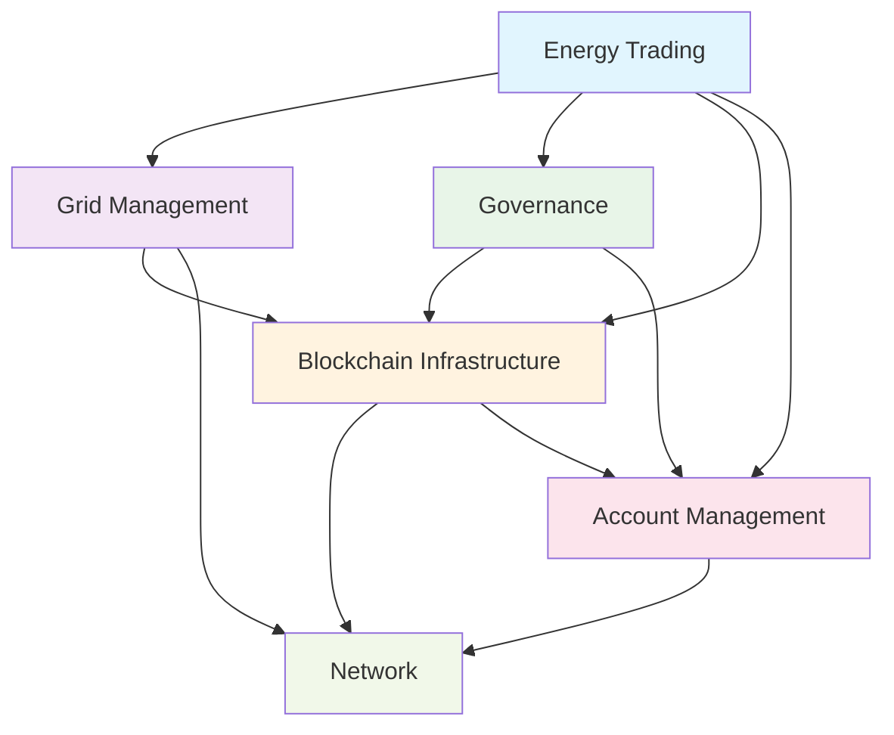

# GridTokenX Blockchain: Domain-Driven Design (DDD) Migration Plan

**Date:** August 9, 2025  
**Project:** GridTokenX Blockchain P2P Energy Trading Platform  
**Current Architecture:** Technical-layer focused modules  
**Target Architecture:** Domain-driven, business-focused bounded contexts  

## Executive Summary

This document outlines a comprehensive migration plan to transform the GridTokenX blockchain from a technical-layer architecture to a Domain-driven Design (DDD) architecture. The migration will reorganize code around business domains, improve maintainability, and create clear bounded contexts that reflect the energy trading business model.

## Table of Contents

1. [Current Architecture Assessment](#current-architecture-assessment)
2. [DDD Principles and Benefits](#ddd-principles-and-benefits) 
3. [Domain Analysis and Bounded Contexts](#domain-analysis-and-bounded-contexts)
4. [Target DDD Architecture](#target-ddd-architecture)
5. [Migration Strategy](#migration-strategy)
6. [Implementation Roadmap](#implementation-roadmap)
7. [Risk Assessment and Mitigation](#risk-assessment-and-mitigation)
8. [Success Criteria](#success-criteria)

## Current Architecture Assessment

### 🔍 Current Structure Analysis

```
src/
├── api.rs              # REST API endpoints (Technical)
├── blockchain/         # Core blockchain logic (Technical)
├── consensus.rs        # Consensus algorithms (Technical)
├── energy.rs          # Energy trading logic (Mixed)
├── governance.rs      # Governance system (Mixed)
├── p2p.rs             # Network layer (Technical)
├── scaling/           # Scaling infrastructure (Technical)
├── storage.rs         # Data persistence (Technical)
└── utils.rs           # Shared utilities (Technical)
```

### ❌ Current Architecture Issues

1. **Technical-Centric Organization**: Modules organized by technology rather than business domains
2. **Mixed Concerns**: Business logic scattered across technical modules
3. **Tight Coupling**: Cross-module dependencies without clear boundaries
4. **Limited Domain Modeling**: Missing rich domain models and business rules
5. **Unclear Bounded Contexts**: No separation between different business areas
6. **Infrastructure Leakage**: Technical concerns mixed with business logic

### ✅ Current Architecture Strengths

1. **Async/Await Pattern**: Good foundation for domain services
2. **Modular Structure**: Existing separation provides migration foundation
3. **Clear Business Domains**: Energy trading and governance are identifiable
4. **Rich Business Logic**: Complex energy market operations already implemented
5. **Event-Driven Elements**: Some pub/sub patterns already in place

## DDD Principles and Benefits

### 🎯 Core DDD Principles

1. **Ubiquitous Language**: Shared vocabulary between business and technical teams
2. **Bounded Contexts**: Clear boundaries between different business areas
3. **Domain Models**: Rich business objects that encapsulate behavior
4. **Aggregates**: Consistency boundaries for business transactions
5. **Domain Services**: Business operations that don't belong to entities
6. **Domain Events**: Capture business events for loose coupling

### 💡 Expected Benefits

- **Better Maintainability**: Code organized around business concepts
- **Improved Testability**: Domain logic isolated from infrastructure
- **Enhanced Scalability**: Clear boundaries enable independent scaling
- **Reduced Complexity**: Separated concerns and clear interfaces
- **Business Alignment**: Code structure reflects business model
- **Future-Proofing**: Easier to adapt to changing business requirements

## Domain Analysis and Bounded Contexts

### 🏢 Identified Business Domains

#### 1. **Energy Trading Domain** 🔋
**Core Business**: Peer-to-peer energy buying and selling
```rust
// Business Concepts:
- Energy Orders (Buy/Sell)
- Order Matching
- Price Discovery
- Trade Execution
- Market Liquidity
- Energy Units (kWh, MWh)

// Key Entities:
- EnergyOrder
- Trade
- Market
- EnergyAsset
- Trader

// Value Objects:
- Price
- EnergyAmount
- GridLocation
- TimeSlot
```

#### 2. **Grid Management Domain** ⚡
**Core Business**: Physical grid operations and monitoring
```rust
// Business Concepts:
- Grid Status Monitoring
- Load Balancing
- Congestion Management
- Grid Stability
- Energy Flow Control

// Key Entities:
- GridNode
- PowerLine
- Substation
- GridStatus

// Value Objects:
- Voltage
- Frequency
- LoadCapacity
- GridCoordinates
```

#### 3. **Governance Domain** 🏛️
**Core Business**: Community decision-making and regulations
```rust
// Business Concepts:
- Proposal Creation
- Voting Process
- Policy Execution
- Authority Management
- Regulatory Compliance

// Key Entities:
- Proposal
- Vote
- Stakeholder
- Authority

// Value Objects:
- VotingPower
- QuorumThreshold
- ProposalType
```

#### 4. **Blockchain Infrastructure Domain** ⛓️
**Core Business**: Distributed ledger operations
```rust
// Business Concepts:
- Transaction Processing
- Block Creation
- Consensus Mechanism
- Network Validation
- Cryptographic Security

// Key Entities:
- Block
- Transaction
- Validator
- ConsensusRound

// Value Objects:
- Hash
- Signature
- Timestamp
- BlockHeight
```

#### 5. **Account Management Domain** 👤
**Core Business**: User identity and wallet operations
```rust
// Business Concepts:
- Account Creation
- Balance Management
- Authentication
- Authorization
- Wallet Operations

// Key Entities:
- Account
- Wallet
- Identity

// Value Objects:
- Address
- Balance
- PublicKey
- PrivateKey
```

#### 6. **Network Domain** 🌐
**Core Business**: P2P communication and node discovery
```rust
// Business Concepts:
- Peer Discovery
- Message Routing
- Network Health
- Reputation System
- Data Synchronization

// Key Entities:
- NetworkNode
- Peer
- Connection

// Value Objects:
- PeerId
- NetworkAddress
- Reputation
- Latency
```

### 🔗 Domain Relationships



## Target DDD Architecture

### 🏗️ New Directory Structure

```
src/
├── main.rs                          # Application entry point
├── lib.rs                           # Library exports
│
├── shared/                          # Shared kernel
│   ├── mod.rs
│   ├── domain/
│   │   ├── value_objects.rs         # Common value objects
│   │   ├── events.rs                # Domain events
│   │   └── errors.rs                # Domain errors
│   ├── infrastructure/
│   │   ├── persistence/
│   │   ├── messaging/
│   │   └── cryptography/
│   └── application/
│       ├── command_bus.rs
│       ├── event_bus.rs
│       └── query_bus.rs
│
├── domains/
│   │
│   ├── energy_trading/              # Energy Trading Bounded Context
│   │   ├── mod.rs
│   │   ├── domain/
│   │   │   ├── entities/
│   │   │   │   ├── energy_order.rs
│   │   │   │   ├── trade.rs
│   │   │   │   ├── market.rs
│   │   │   │   └── trader.rs
│   │   │   ├── value_objects/
│   │   │   │   ├── price.rs
│   │   │   │   ├── energy_amount.rs
│   │   │   │   ├── grid_location.rs
│   │   │   │   └── time_slot.rs
│   │   │   ├── aggregates/
│   │   │   │   ├── order_book.rs
│   │   │   │   └── trading_session.rs
│   │   │   ├── services/
│   │   │   │   ├── order_matching_service.rs
│   │   │   │   ├── price_discovery_service.rs
│   │   │   │   └── trade_execution_service.rs
│   │   │   ├── repositories/
│   │   │   │   ├── order_repository.rs
│   │   │   │   └── trade_repository.rs
│   │   │   └── events/
│   │   │       ├── order_placed.rs
│   │   │       ├── trade_executed.rs
│   │   │       └── market_updated.rs
│   │   ├── application/
│   │   │   ├── commands/
│   │   │   │   ├── place_order.rs
│   │   │   │   ├── cancel_order.rs
│   │   │   │   └── execute_trade.rs
│   │   │   ├── queries/
│   │   │   │   ├── get_order_book.rs
│   │   │   │   ├── get_trade_history.rs
│   │   │   │   └── get_market_stats.rs
│   │   │   └── handlers/
│   │   │       ├── command_handlers.rs
│   │   │       ├── query_handlers.rs
│   │   │       └── event_handlers.rs
│   │   └── infrastructure/
│   │       ├── persistence/
│   │       │   ├── order_repository_impl.rs
│   │       │   └── trade_repository_impl.rs
│   │       ├── external_services/
│   │       │   ├── grid_api_client.rs
│   │       │   └── pricing_api_client.rs
│   │       └── api/
│   │           ├── rest_controllers.rs
│   │           └── graphql_resolvers.rs
│   │
│   ├── grid_management/             # Grid Management Bounded Context
│   │   ├── mod.rs
│   │   ├── domain/
│   │   │   ├── entities/
│   │   │   │   ├── grid_node.rs
│   │   │   │   ├── power_line.rs
│   │   │   │   ├── substation.rs
│   │   │   │   └── grid_status.rs
│   │   │   ├── value_objects/
│   │   │   │   ├── voltage.rs
│   │   │   │   ├── frequency.rs
│   │   │   │   ├── load_capacity.rs
│   │   │   │   └── grid_coordinates.rs
│   │   │   ├── aggregates/
│   │   │   │   ├── grid_topology.rs
│   │   │   │   └── monitoring_system.rs
│   │   │   ├── services/
│   │   │   │   ├── load_balancing_service.rs
│   │   │   │   ├── congestion_management_service.rs
│   │   │   │   └── stability_monitoring_service.rs
│   │   │   └── repositories/
│   │   │       ├── grid_status_repository.rs
│   │   │       └── monitoring_data_repository.rs
│   │   ├── application/
│   │   │   ├── commands/
│   │   │   ├── queries/
│   │   │   └── handlers/
│   │   └── infrastructure/
│   │       ├── persistence/
│   │       ├── external_services/
│   │       └── api/
│   │
│   ├── governance/                  # Governance Bounded Context
│   │   ├── mod.rs
│   │   ├── domain/
│   │   │   ├── entities/
│   │   │   │   ├── proposal.rs
│   │   │   │   ├── vote.rs
│   │   │   │   ├── stakeholder.rs
│   │   │   │   └── authority.rs
│   │   │   ├── value_objects/
│   │   │   │   ├── voting_power.rs
│   │   │   │   ├── quorum_threshold.rs
│   │   │   │   └── proposal_type.rs
│   │   │   ├── aggregates/
│   │   │   │   ├── governance_process.rs
│   │   │   │   └── voting_session.rs
│   │   │   ├── services/
│   │   │   │   ├── proposal_validation_service.rs
│   │   │   │   ├── voting_service.rs
│   │   │   │   └── execution_service.rs
│   │   │   └── repositories/
│   │   │       ├── proposal_repository.rs
│   │   │       └── vote_repository.rs
│   │   ├── application/
│   │   └── infrastructure/
│   │
│   ├── blockchain_infrastructure/   # Blockchain Infrastructure Bounded Context
│   │   ├── mod.rs
│   │   ├── domain/
│   │   │   ├── entities/
│   │   │   │   ├── block.rs
│   │   │   │   ├── transaction.rs
│   │   │   │   ├── validator.rs
│   │   │   │   └── consensus_round.rs
│   │   │   ├── value_objects/
│   │   │   │   ├── hash.rs
│   │   │   │   ├── signature.rs
│   │   │   │   ├── timestamp.rs
│   │   │   │   └── block_height.rs
│   │   │   ├── aggregates/
│   │   │   │   ├── blockchain.rs
│   │   │   │   └── consensus_state.rs
│   │   │   ├── services/
│   │   │   │   ├── transaction_validation_service.rs
│   │   │   │   ├── block_validation_service.rs
│   │   │   │   └── consensus_service.rs
│   │   │   └── repositories/
│   │   │       ├── block_repository.rs
│   │   │       └── transaction_repository.rs
│   │   ├── application/
│   │   └── infrastructure/
│   │
│   ├── account_management/          # Account Management Bounded Context
│   │   ├── mod.rs
│   │   ├── domain/
│   │   │   ├── entities/
│   │   │   │   ├── account.rs
│   │   │   │   ├── wallet.rs
│   │   │   │   └── identity.rs
│   │   │   ├── value_objects/
│   │   │   │   ├── address.rs
│   │   │   │   ├── balance.rs
│   │   │   │   ├── public_key.rs
│   │   │   │   └── private_key.rs
│   │   │   ├── aggregates/
│   │   │   │   └── user_account.rs
│   │   │   ├── services/
│   │   │   │   ├── authentication_service.rs
│   │   │   │   ├── authorization_service.rs
│   │   │   │   └── wallet_service.rs
│   │   │   └── repositories/
│   │   │       ├── account_repository.rs
│   │   │       └── wallet_repository.rs
│   │   ├── application/
│   │   └── infrastructure/
│   │
│   └── network/                     # Network Bounded Context
│       ├── mod.rs
│       ├── domain/
│       │   ├── entities/
│       │   │   ├── network_node.rs
│       │   │   ├── peer.rs
│       │   │   └── connection.rs
│       │   ├── value_objects/
│       │   │   ├── peer_id.rs
│       │   │   ├── network_address.rs
│       │   │   ├── reputation.rs
│       │   │   └── latency.rs
│       │   ├── aggregates/
│       │   │   └── network_topology.rs
│       │   ├── services/
│       │   │   ├── peer_discovery_service.rs
│       │   │   ├── message_routing_service.rs
│       │   │   └── reputation_service.rs
│       │   └── repositories/
│       │       ├── peer_repository.rs
│       │       └── network_state_repository.rs
│       ├── application/
│       └── infrastructure/
│
└── interfaces/                      # Interface adapters
    ├── api/
    │   ├── rest/
    │   │   ├── energy_trading_controller.rs
    │   │   ├── grid_management_controller.rs
    │   │   ├── governance_controller.rs
    │   │   └── account_controller.rs
    │   ├── graphql/
    │   │   └── schema.rs
    │   └── websocket/
    │       └── real_time_handler.rs
    ├── cli/
    │   └── commands/
    └── events/
        ├── domain_event_dispatcher.rs
        └── integration_event_handler.rs
```

### 🎯 Key DDD Patterns Implementation

#### 1. **Domain Entities**
```rust
// domains/energy_trading/domain/entities/energy_order.rs
use uuid::Uuid;
use chrono::{DateTime, Utc};
use crate::shared::domain::events::DomainEvent;

#[derive(Debug, Clone)]
pub struct EnergyOrder {
    id: OrderId,
    trader_id: TraderId,
    order_type: OrderType,
    energy_amount: EnergyAmount,
    price: Price,
    grid_location: GridLocation,
    time_slot: TimeSlot,
    status: OrderStatus,
    created_at: DateTime<Utc>,
    events: Vec<Box<dyn DomainEvent>>,
}

impl EnergyOrder {
    pub fn place_order(
        trader_id: TraderId,
        order_type: OrderType,
        energy_amount: EnergyAmount,
        price: Price,
        grid_location: GridLocation,
        time_slot: TimeSlot,
    ) -> Result<Self> {
        // Business logic validation
        Self::validate_order_parameters(&energy_amount, &price, &grid_location)?;
        
        let order = Self {
            id: OrderId::new(),
            trader_id,
            order_type,
            energy_amount,
            price,
            grid_location,
            time_slot,
            status: OrderStatus::Active,
            created_at: Utc::now(),
            events: vec![],
        };
        
        // Raise domain event
        order.raise_event(OrderPlacedEvent::new(&order));
        
        Ok(order)
    }
    
    pub fn cancel(&mut self) -> Result<()> {
        match self.status {
            OrderStatus::Active | OrderStatus::PartiallyFilled => {
                self.status = OrderStatus::Cancelled;
                self.raise_event(OrderCancelledEvent::new(&self));
                Ok(())
            }
            _ => Err(anyhow!("Order cannot be cancelled in current status")),
        }
    }
    
    fn validate_order_parameters(
        energy_amount: &EnergyAmount,
        price: &Price,
        grid_location: &GridLocation,
    ) -> Result<()> {
        // Domain business rules
        if energy_amount.value() <= 0.0 {
            return Err(anyhow!("Energy amount must be positive"));
        }
        
        if price.value() <= 0 {
            return Err(anyhow!("Price must be positive"));
        }
        
        if !grid_location.is_valid_thai_location() {
            return Err(anyhow!("Invalid Thai grid location"));
        }
        
        Ok(())
    }
}
```

#### 2. **Value Objects**
```rust
// domains/energy_trading/domain/value_objects/price.rs
use std::fmt;
use serde::{Deserialize, Serialize};

#[derive(Debug, Clone, Copy, PartialEq, Eq, Hash, Serialize, Deserialize)]
pub struct Price {
    value_in_tokens: u64, // Price in smallest token unit
}

impl Price {
    pub fn new(value_in_tokens: u64) -> Result<Self> {
        if value_in_tokens == 0 {
            return Err(anyhow!("Price cannot be zero"));
        }
        Ok(Self { value_in_tokens })
    }
    
    pub fn from_kwh_price(kwh_price: f64) -> Result<Self> {
        if kwh_price <= 0.0 {
            return Err(anyhow!("kWh price must be positive"));
        }
        
        // Convert to smallest token unit (assuming 6 decimal places)
        let value_in_tokens = (kwh_price * 1_000_000.0) as u64;
        Self::new(value_in_tokens)
    }
    
    pub fn value(&self) -> u64 {
        self.value_in_tokens
    }
    
    pub fn to_kwh_price(&self) -> f64 {
        self.value_in_tokens as f64 / 1_000_000.0
    }
    
    pub fn multiply(&self, multiplier: f64) -> Result<Self> {
        let new_value = (self.value_in_tokens as f64 * multiplier) as u64;
        Self::new(new_value)
    }
}

impl fmt::Display for Price {
    fn fmt(&self, f: &mut fmt::Formatter<'_>) -> fmt::Result {
        write!(f, "{:.6} GTX/kWh", self.to_kwh_price())
    }
}
```

#### 3. **Aggregates**
```rust
// domains/energy_trading/domain/aggregates/order_book.rs
use std::collections::BTreeMap;
use crate::domains::energy_trading::domain::entities::EnergyOrder;
use crate::domains::energy_trading::domain::value_objects::{Price, GridLocation};
use crate::shared::domain::events::DomainEvent;

#[derive(Debug)]
pub struct OrderBook {
    grid_location: GridLocation,
    buy_orders: BTreeMap<Price, Vec<EnergyOrder>>, // Sorted by price (highest first)
    sell_orders: BTreeMap<Price, Vec<EnergyOrder>>, // Sorted by price (lowest first)
    events: Vec<Box<dyn DomainEvent>>,
}

impl OrderBook {
    pub fn new(grid_location: GridLocation) -> Self {
        Self {
            grid_location,
            buy_orders: BTreeMap::new(),
            sell_orders: BTreeMap::new(),
            events: vec![],
        }
    }
    
    pub fn add_order(&mut self, order: EnergyOrder) -> Result<Vec<Trade>> {
        // Validate order belongs to this grid location
        if order.grid_location() != &self.grid_location {
            return Err(anyhow!("Order grid location mismatch"));
        }
        
        let trades = match order.order_type() {
            OrderType::Buy => self.process_buy_order(order)?,
            OrderType::Sell => self.process_sell_order(order)?,
        };
        
        // Raise market updated event
        self.raise_event(MarketUpdatedEvent::new(&self.grid_location, &trades));
        
        Ok(trades)
    }
    
    fn process_buy_order(&mut self, mut buy_order: EnergyOrder) -> Result<Vec<Trade>> {
        let mut trades = Vec::new();
        let buy_price = *buy_order.price();
        
        // Find matching sell orders (price <= buy_price)
        let matching_prices: Vec<Price> = self.sell_orders
            .keys()
            .filter(|&&sell_price| sell_price <= buy_price)
            .cloned()
            .collect();
        
        for sell_price in matching_prices {
            if buy_order.remaining_amount().value() == 0.0 {
                break;
            }
            
            if let Some(sell_orders) = self.sell_orders.get_mut(&sell_price) {
                while !sell_orders.is_empty() && buy_order.remaining_amount().value() > 0.0 {
                    let mut sell_order = sell_orders.remove(0);
                    
                    let trade = self.create_trade(&mut buy_order, &mut sell_order, sell_price)?;
                    trades.push(trade);
                    
                    // Re-add sell order if partially filled
                    if sell_order.remaining_amount().value() > 0.0 {
                        sell_orders.insert(0, sell_order);
                    }
                }
                
                // Remove empty price levels
                if sell_orders.is_empty() {
                    self.sell_orders.remove(&sell_price);
                }
            }
        }
        
        // Add remaining buy order to book
        if buy_order.remaining_amount().value() > 0.0 {
            self.buy_orders
                .entry(buy_price)
                .or_insert_with(Vec::new)
                .push(buy_order);
        }
        
        Ok(trades)
    }
    
    fn create_trade(
        &mut self,
        buy_order: &mut EnergyOrder,
        sell_order: &mut EnergyOrder,
        execution_price: Price,
    ) -> Result<Trade> {
        let trade_amount = EnergyAmount::new(
            buy_order.remaining_amount().value()
                .min(sell_order.remaining_amount().value())
        )?;
        
        // Update order statuses
        buy_order.fill_partially(trade_amount)?;
        sell_order.fill_partially(trade_amount)?;
        
        let trade = Trade::new(
            buy_order.id(),
            sell_order.id(),
            trade_amount,
            execution_price,
            self.grid_location.clone(),
        )?;
        
        // Raise trade executed event
        self.raise_event(TradeExecutedEvent::new(&trade));
        
        Ok(trade)
    }
}
```

#### 4. **Domain Services**
```rust
// domains/energy_trading/domain/services/order_matching_service.rs
use crate::domains::energy_trading::domain::aggregates::OrderBook;
use crate::domains::energy_trading::domain::entities::{EnergyOrder, Trade};
use crate::domains::energy_trading::domain::value_objects::GridLocation;

pub struct OrderMatchingService {
    order_books: HashMap<GridLocation, OrderBook>,
}

impl OrderMatchingService {
    pub fn new() -> Self {
        Self {
            order_books: HashMap::new(),
        }
    }
    
    pub async fn process_order(&mut self, order: EnergyOrder) -> Result<Vec<Trade>> {
        let grid_location = order.grid_location().clone();
        
        // Get or create order book for this grid location
        let order_book = self.order_books
            .entry(grid_location.clone())
            .or_insert_with(|| OrderBook::new(grid_location));
        
        // Process order and return trades
        order_book.add_order(order)
    }
    
    pub async fn get_market_depth(&self, grid_location: &GridLocation) -> Option<MarketDepth> {
        self.order_books
            .get(grid_location)
            .map(|book| book.calculate_market_depth())
    }
}
```

#### 5. **Application Services (Use Cases)**
```rust
// domains/energy_trading/application/commands/place_order.rs
use crate::domains::energy_trading::domain::entities::EnergyOrder;
use crate::domains::energy_trading::domain::services::OrderMatchingService;
use crate::domains::energy_trading::domain::repositories::OrderRepository;
use crate::shared::application::command_bus::CommandHandler;

#[derive(Debug)]
pub struct PlaceOrderCommand {
    pub trader_id: String,
    pub order_type: String,
    pub energy_amount: f64,
    pub price_per_kwh: f64,
    pub grid_location: String,
    pub time_slot_start: DateTime<Utc>,
    pub time_slot_end: DateTime<Utc>,
}

#[derive(Debug)]
pub struct PlaceOrderResult {
    pub order_id: String,
    pub trades: Vec<TradeResult>,
    pub status: String,
}

pub struct PlaceOrderHandler {
    order_repository: Arc<dyn OrderRepository>,
    order_matching_service: Arc<RwLock<OrderMatchingService>>,
}

impl PlaceOrderHandler {
    pub fn new(
        order_repository: Arc<dyn OrderRepository>,
        order_matching_service: Arc<RwLock<OrderMatchingService>>,
    ) -> Self {
        Self {
            order_repository,
            order_matching_service,
        }
    }
}

#[async_trait]
impl CommandHandler<PlaceOrderCommand, PlaceOrderResult> for PlaceOrderHandler {
    async fn handle(&self, command: PlaceOrderCommand) -> Result<PlaceOrderResult> {
        // Convert command to domain objects
        let trader_id = TraderId::new(command.trader_id)?;
        let order_type = OrderType::from_string(&command.order_type)?;
        let energy_amount = EnergyAmount::new(command.energy_amount)?;
        let price = Price::from_kwh_price(command.price_per_kwh)?;
        let grid_location = GridLocation::new(command.grid_location)?;
        let time_slot = TimeSlot::new(command.time_slot_start, command.time_slot_end)?;
        
        // Create domain entity
        let order = EnergyOrder::place_order(
            trader_id,
            order_type,
            energy_amount,
            price,
            grid_location,
            time_slot,
        )?;
        
        // Process order through domain service
        let mut matching_service = self.order_matching_service.write().await;
        let trades = matching_service.process_order(order.clone()).await?;
        
        // Persist order
        self.order_repository.save(order.clone()).await?;
        
        // Convert to result
        Ok(PlaceOrderResult {
            order_id: order.id().to_string(),
            trades: trades.into_iter().map(|t| t.into()).collect(),
            status: order.status().to_string(),
        })
    }
}
```

## Migration Strategy

### 🎯 Migration Approach: **Strangler Fig Pattern**

The migration will use the Strangler Fig pattern to gradually replace the existing technical-layer architecture with domain-driven bounded contexts while maintaining system functionality.

#### Phase 1: **Foundation & Shared Kernel** (Weeks 1-2)
1. **Create shared infrastructure**
   - Set up new directory structure
   - Implement shared domain events system
   - Create command/query bus infrastructure
   - Establish common value objects

2. **Extract shared components**
   - Move cryptography utilities to shared kernel
   - Extract common error types
   - Create shared messaging infrastructure

#### Phase 2: **Domain Extraction** (Weeks 3-6)
1. **Energy Trading Domain (Week 3)**
   - Extract energy trading logic from `energy.rs`
   - Create EnergyOrder, Trade, and Market entities
   - Implement Price, EnergyAmount value objects
   - Build OrderBook aggregate

2. **Account Management Domain (Week 4)**
   - Extract account logic from blockchain module
   - Create Account, Wallet entities
   - Implement Address, Balance value objects
   - Build authentication/authorization services

3. **Governance Domain (Week 5)**
   - Extract governance logic from `governance.rs`
   - Create Proposal, Vote entities
   - Implement voting business rules
   - Build governance process aggregate

4. **Grid Management Domain (Week 6)**
   - Extract grid monitoring from energy module
   - Create GridNode, GridStatus entities
   - Implement grid-specific value objects
   - Build monitoring services

#### Phase 3: **Infrastructure Refactoring** (Weeks 7-8)
1. **Blockchain Infrastructure Domain**
   - Refactor blockchain core as bounded context
   - Extract consensus logic as domain service
   - Implement block and transaction entities
   - Create repository abstractions

2. **Network Domain**
   - Refactor P2P networking as bounded context
   - Create peer and connection entities
   - Implement network topology aggregate
   - Build reputation and discovery services

#### Phase 4: **API & Integration Layer** (Weeks 9-10)
1. **Bounded Context Integration**
   - Implement anti-corruption layers
   - Create domain event handlers
   - Build integration event system
   - Establish context maps

2. **API Restructuring**
   - Migrate REST endpoints to new structure
   - Implement GraphQL schema
   - Create WebSocket handlers
   - Update CLI commands

#### Phase 5: **Testing & Optimization** (Weeks 11-12)
1. **Domain Testing**
   - Unit tests for domain entities
   - Integration tests for aggregates
   - Domain service testing
   - Event system testing

2. **Performance Optimization**
   - Repository optimization
   - Event handling performance
   - Memory usage analysis
   - Concurrent access patterns

### 📋 Migration Tasks Breakdown

#### Week 1-2: Foundation
```bash
# Tasks:
□ Create new directory structure
□ Implement shared domain events infrastructure
□ Create command/query bus system
□ Extract shared value objects (Hash, Signature, Timestamp)
□ Set up integration testing framework
□ Update CI/CD pipeline for new structure

# Deliverables:
- shared/ module with infrastructure
- Event bus system operational
- Command/query handling framework
- Migration guide documentation
```

#### Week 3: Energy Trading Domain
```bash
# Tasks:
□ Create EnergyOrder entity with business logic
□ Implement Price, EnergyAmount, GridLocation value objects
□ Build OrderBook aggregate with matching logic
□ Create OrderMatchingService domain service
□ Implement order repositories
□ Create PlaceOrder, CancelOrder commands
□ Build order-related queries
□ Add comprehensive unit tests

# Migration Steps:
1. Copy existing energy.rs logic
2. Extract and refactor as domain entities
3. Implement value object validations
4. Create aggregate consistency boundaries
5. Test domain logic isolation
6. Integrate with existing API gradually
```

#### Week 4: Account Management Domain
```bash
# Tasks:
□ Create Account, Wallet entities
□ Implement Address, Balance, PublicKey value objects
□ Build UserAccount aggregate
□ Create AuthenticationService, WalletService
□ Implement account repositories
□ Create CreateAccount, UpdateBalance commands
□ Build account-related queries
□ Add security and validation tests

# Migration Steps:
1. Extract account logic from blockchain module
2. Create rich domain model for accounts
3. Implement wallet management business rules
4. Create authentication/authorization services
5. Test account operations
6. Migrate API endpoints gradually
```

#### Week 5: Governance Domain
```bash
# Tasks:
□ Create Proposal, Vote, Stakeholder entities
□ Implement VotingPower, QuorumThreshold value objects
□ Build GovernanceProcess aggregate
□ Create ProposalValidationService, VotingService
□ Implement governance repositories
□ Create CreateProposal, CastVote commands
□ Build governance queries
□ Add governance rule tests

# Migration Steps:
1. Extract governance.rs domain logic
2. Model proposal lifecycle as aggregate
3. Implement voting business rules
4. Create proposal validation services
5. Test governance workflows
6. Migrate governance API
```

#### Week 6: Grid Management Domain
```bash
# Tasks:
□ Create GridNode, PowerLine, GridStatus entities
□ Implement Voltage, Frequency, LoadCapacity value objects
□ Build GridTopology aggregate
□ Create LoadBalancingService, MonitoringService
□ Implement grid repositories
□ Create grid management commands
□ Build grid monitoring queries
□ Add grid stability tests

# Migration Steps:
1. Extract grid logic from energy module
2. Model physical grid as domain entities
3. Implement grid monitoring business rules
4. Create load balancing services
5. Test grid operations
6. Integrate with energy trading
```

### 🔧 Technical Migration Guidelines

#### 1. **Gradual Interface Migration**
```rust
// Old interface (maintain during migration)
pub mod energy {
    pub use crate::domains::energy_trading::application::facades::EnergyTradingFacade;
    
    // Deprecated - use EnergyTradingFacade
    #[deprecated(note = "Use domains::energy_trading instead")]
    pub struct EnergyTrading {
        facade: EnergyTradingFacade,
    }
    
    impl EnergyTrading {
        #[deprecated]
        pub async fn place_order(&self, /* old params */) -> Result<String> {
            // Delegate to new domain
            self.facade.place_order(/* convert params */).await
        }
    }
}
```

#### 2. **Anti-Corruption Layers**
```rust
// domains/energy_trading/infrastructure/adapters/blockchain_adapter.rs
pub struct BlockchainAdapter {
    blockchain_service: Arc<dyn BlockchainInfrastructureService>,
}

impl BlockchainAdapter {
    pub async fn submit_trade_transaction(&self, trade: &Trade) -> Result<TransactionId> {
        // Convert domain model to blockchain transaction
        let blockchain_tx = self.convert_trade_to_transaction(trade)?;
        
        // Submit through blockchain infrastructure
        self.blockchain_service.submit_transaction(blockchain_tx).await
    }
    
    fn convert_trade_to_transaction(&self, trade: &Trade) -> Result<BlockchainTransaction> {
        // Anti-corruption layer: Domain -> Infrastructure
        BlockchainTransaction::new_energy_trade(
            trade.buyer_id().to_string(),
            trade.seller_id().to_string(),
            trade.energy_amount().value(),
            trade.price().value(),
            trade.grid_location().to_string(),
        )
    }
}
```

#### 3. **Domain Event Integration**
```rust
// shared/domain/events.rs
pub trait DomainEvent: Send + Sync {
    fn event_type(&self) -> &'static str;
    fn aggregate_id(&self) -> String;
    fn occurred_at(&self) -> DateTime<Utc>;
    fn event_data(&self) -> serde_json::Value;
}

// domains/energy_trading/domain/events/trade_executed.rs
#[derive(Debug, Clone, Serialize)]
pub struct TradeExecutedEvent {
    pub trade_id: String,
    pub buyer_id: String,
    pub seller_id: String,
    pub energy_amount: f64,
    pub price: u64,
    pub grid_location: String,
    pub executed_at: DateTime<Utc>,
}

impl DomainEvent for TradeExecutedEvent {
    fn event_type(&self) -> &'static str {
        "TradeExecuted"
    }
    
    fn aggregate_id(&self) -> String {
        self.trade_id.clone()
    }
    
    fn occurred_at(&self) -> DateTime<Utc> {
        self.executed_at
    }
    
    fn event_data(&self) -> serde_json::Value {
        serde_json::to_value(self).unwrap()
    }
}
```

## Implementation Roadmap

### 📅 Detailed Timeline

| **Week** | **Focus Area** | **Key Deliverables** | **Success Criteria** |
|----------|----------------|----------------------|----------------------|
| **1-2** | Foundation Setup | Shared kernel, Event bus, Directory structure | ✅ New structure builds<br>✅ Event system works<br>✅ Tests pass |
| **3** | Energy Trading Domain | EnergyOrder entity, OrderBook aggregate, Commands | ✅ Domain tests pass<br>✅ Business rules enforced<br>✅ API integration |
| **4** | Account Management | Account entity, Wallet services, Auth commands | ✅ Account operations work<br>✅ Security tests pass<br>✅ Migration complete |
| **5** | Governance Domain | Proposal entity, Voting services, Governance commands | ✅ Governance workflows<br>✅ Voting rules enforced<br>✅ API updated |
| **6** | Grid Management | GridNode entity, Monitoring services, Grid commands | ✅ Grid monitoring works<br>✅ Load balancing active<br>✅ Integration tests |
| **7-8** | Infrastructure & Network | Blockchain domain, P2P domain, Repository abstractions | ✅ Blockchain as domain<br>✅ Network isolated<br>✅ Clean boundaries |
| **9-10** | API & Integration | REST restructure, GraphQL, Event handlers | ✅ APIs operational<br>✅ Events flowing<br>✅ Integration complete |
| **11-12** | Testing & Optimization | Comprehensive testing, Performance tuning | ✅ Full test coverage<br>✅ Performance targets<br>✅ Documentation |

### 🎯 Milestone Gates

#### Gate 1: Foundation Ready (End of Week 2)
- [ ] New directory structure operational
- [ ] Shared kernel infrastructure working
- [ ] Event bus system functional
- [ ] Command/query framework ready
- [ ] CI/CD pipeline updated
- [ ] Migration documentation complete

#### Gate 2: Core Domains Migrated (End of Week 6)
- [ ] Energy Trading domain fully operational
- [ ] Account Management domain migrated
- [ ] Governance domain restructured
- [ ] Grid Management domain functional
- [ ] Domain tests achieving 90%+ coverage
- [ ] API backwards compatibility maintained

#### Gate 3: Infrastructure Modernized (End of Week 8)
- [ ] Blockchain as bounded context
- [ ] Network domain isolated
- [ ] Repository abstractions implemented
- [ ] Anti-corruption layers operational
- [ ] Domain event integration complete
- [ ] Performance benchmarks met

#### Gate 4: Integration Complete (End of Week 10)
- [ ] All APIs restructured
- [ ] GraphQL schema operational
- [ ] WebSocket handlers updated
- [ ] Integration events flowing
- [ ] CLI commands migrated
- [ ] End-to-end tests passing

#### Gate 5: Production Ready (End of Week 12)
- [ ] Comprehensive test suite (95%+ coverage)
- [ ] Performance optimizations complete
- [ ] Documentation updated
- [ ] Monitoring and observability
- [ ] Security review passed
- [ ] Migration rollback plan ready

### 📊 Success Metrics

#### Technical Metrics
- **Code Quality**: Cyclomatic complexity < 10, Test coverage > 95%
- **Performance**: Response time < 100ms, Throughput > 1000 TPS
- **Maintainability**: Coupling metrics improved by 50%
- **Domain Alignment**: Business logic centralized in domain layers

#### Business Metrics
- **Feature Velocity**: New feature development 30% faster
- **Bug Reduction**: Production bugs reduced by 60%
- **Onboarding Time**: New developer productivity improved by 40%
- **Business Understanding**: Domain expert validation sessions

## Risk Assessment and Mitigation

### 🚨 High-Risk Areas

#### 1. **Compilation Dependencies** 
**Risk Level**: 🔴 HIGH
**Description**: Existing compilation issues may complicate migration
**Mitigation**:
- Fix existing compilation errors before starting migration
- Maintain working builds throughout migration
- Use feature flags for gradual rollout
- Implement comprehensive regression testing

#### 2. **API Backwards Compatibility**
**Risk Level**: 🟡 MEDIUM
**Description**: Breaking changes may affect existing integrations
**Mitigation**:
- Maintain facade pattern for existing APIs
- Implement versioned endpoints
- Provide migration guides for API consumers
- Use deprecation warnings with clear timelines

#### 3. **Performance Regression**
**Risk Level**: 🟡 MEDIUM  
**Description**: Additional abstraction layers may impact performance
**Mitigation**:
- Establish performance baselines before migration
- Implement continuous performance monitoring
- Optimize hot paths during migration
- Use profiling tools to identify bottlenecks

#### 4. **Team Knowledge Transfer**
**Risk Level**: 🟡 MEDIUM
**Description**: Team may need time to learn DDD concepts
**Mitigation**:
- Provide DDD training sessions
- Create comprehensive documentation
- Implement pair programming for knowledge transfer
- Establish code review guidelines for DDD patterns

### 🛡️ Risk Mitigation Strategies

#### 1. **Incremental Migration**
```rust
// Use feature flags for gradual rollout
#[cfg(feature = "ddd-energy-trading")]
mod new_energy_trading {
    pub use crate::domains::energy_trading::*;
}

#[cfg(not(feature = "ddd-energy-trading"))]
mod legacy_energy_trading {
    pub use crate::energy::*;
}
```

#### 2. **Parallel Implementation**
```rust
// Run old and new implementations in parallel during transition
pub struct EnergyTradingService {
    #[cfg(feature = "legacy-energy")]
    legacy_service: LegacyEnergyTrading,
    
    #[cfg(feature = "ddd-energy")]
    domain_service: EnergyTradingDomain,
}

impl EnergyTradingService {
    pub async fn place_order(&self, order_data: OrderData) -> Result<OrderResult> {
        #[cfg(feature = "compare-implementations")]
        {
            // Run both implementations and compare results
            let legacy_result = self.legacy_service.place_order(order_data.clone()).await;
            let domain_result = self.domain_service.place_order(order_data).await;
            self.compare_and_log_differences(&legacy_result, &domain_result);
            domain_result
        }
        
        #[cfg(feature = "ddd-energy")]
        self.domain_service.place_order(order_data).await
        
        #[cfg(not(feature = "ddd-energy"))]
        self.legacy_service.place_order(order_data).await
    }
}
```

#### 3. **Rollback Strategy**
```bash
# Git-based rollback strategy
git tag migration-checkpoint-week-1
git tag migration-checkpoint-week-2
# ... continue for each week

# If rollback needed:
git revert-merge migration-branch
git checkout migration-checkpoint-week-X
```

## Success Criteria

### 🎯 Definition of Done

#### Domain Model Quality
- [ ] **Rich Domain Models**: Entities contain business logic, not just data
- [ ] **Business Rules Enforced**: All business constraints implemented in domain layer  
- [ ] **Immutable Value Objects**: Value objects are immutable and self-validating
- [ ] **Clear Aggregates**: Consistency boundaries clearly defined
- [ ] **Domain Events**: Business events captured and handled appropriately

#### Architecture Quality  
- [ ] **Bounded Contexts**: Clear boundaries between business domains
- [ ] **Dependency Direction**: Dependencies point inward toward domain
- [ ] **Technology Independence**: Domain layer has no infrastructure dependencies
- [ ] **Testability**: Domain logic unit testable without external dependencies
- [ ] **Interface Segregation**: Small, focused interfaces between layers

#### Code Quality
- [ ] **Test Coverage**: 95%+ coverage for domain logic
- [ ] **Documentation**: Comprehensive domain model documentation
- [ ] **Performance**: No regression in key performance metrics
- [ ] **Maintainability**: Improved coupling and cohesion metrics
- [ ] **Readability**: Code expresses business intent clearly

#### Business Alignment
- [ ] **Ubiquitous Language**: Code uses business terminology consistently
- [ ] **Domain Expert Validation**: Business rules validated by domain experts
- [ ] **Feature Velocity**: Faster development of new business features  
- [ ] **Bug Reduction**: Fewer business logic bugs in production
- [ ] **Onboarding**: New developers understand business logic faster

### 📈 Post-Migration Benefits

#### Short-term Benefits (1-3 months)
- **Improved Code Organization**: Easier to find and modify business logic
- **Better Testing**: Domain logic tested independently of infrastructure
- **Clearer Responsibilities**: Each bounded context has clear ownership
- **Reduced Compilation Issues**: Better module separation reduces dependencies

#### Medium-term Benefits (3-6 months)  
- **Faster Feature Development**: New features built on solid domain foundation
- **Easier Maintenance**: Business changes localized to specific domains
- **Better Performance**: Optimized domain services and repositories
- **Improved Quality**: Fewer bugs due to better business rule enforcement

#### Long-term Benefits (6+ months)
- **Strategic Business Agility**: Rapid adaptation to market changes
- **Technical Debt Reduction**: Clean architecture prevents technical debt
- **Team Productivity**: Developers more productive with clear domain models
- **System Evolution**: Easier to evolve and extend business capabilities

---

## Conclusion

This DDD migration plan provides a comprehensive roadmap for transforming the GridTokenX blockchain from a technical-layer architecture to a domain-driven design. The migration will improve code organization, business alignment, and long-term maintainability while minimizing risks through incremental implementation and careful testing.

The key to success will be maintaining system functionality throughout the migration while gradually introducing domain-driven concepts and patterns. With proper planning, execution, and monitoring, this migration will establish a solid foundation for the future evolution of the GridTokenX energy trading platform.

**Next Steps:**
1. Review and approve migration plan with stakeholders
2. Set up development environment with new directory structure  
3. Begin Phase 1: Foundation & Shared Kernel implementation
4. Establish regular checkpoint reviews and progress monitoring
5. Execute migration according to timeline with continuous risk assessment

---
**Document Version:** 1.0  
**Last Updated:** August 9, 2025  
**Review Date:** August 16, 2025
